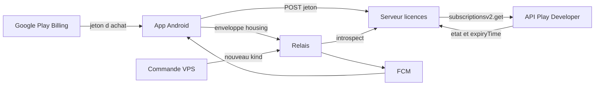

# Plan de travail — Billing étape 2 + essai/grâce + notification opérateur

Élaboration **terminée** pour le travail produit. L’activation Google (compte de service, consoles) est un **prérequis ops séparé** : le détail est en annexe ; on n’en discute plus ici jusqu’à tes questions.

Ce n’est **pas** un nouveau catalogue Play (étape 0) ni un nouveau branchement d’achat dans l’app (étape 1). L’étape 2, c’est : **le serveur licences arrête de croire le client** et interroge Google Play avec le jeton d’achat.

## Contenu de cette livraison (figé le 15 août)

- Étape 2 : vérification réelle des jetons Play sur le serveur licences.
- Essai logement **14 jours** après usage actif (dépense réalisée synchronisée, pas une simple modification de plan).
- **Fin d’essai** sans abonnement logement → **grâce 7 jours** (l’app reste utilisable).
- **Rappels d’essai** (OpenSpec 2.1) : début (avec date de fin), 1 semaine restante, chaque jour les 3 derniers jours. Tap → écran Licences. Ton rassurant, pas de paywall agressif ailleurs.
- **Rappels de grâce** (OpenSpec 2.2) : **tous** les participants, **chaque jour** pendant les 7 jours ; la durée restante et l’action requise sont visibles.
- **Lecture seule** après la grâce (OpenSpec 2.3) : bannière qui dit ce qui est bloqué et pourquoi ; consultation de l’historique ; pas de nouvelle dépense réalisée ; l’export (Réglages → Exporter) **reste** disponible (déjà exigé ailleurs ; on vérifie qu’on ne le cache pas).
- Un abonnement Play valide (module ou bundle qui couvre le logement) **interrompt** essai/grâce/lecture seule.
- Notification opérateur (relais) : commande VPS uniquement, nouveau `kind` FCM, page in-app (numéro de build + éventuellement lien vers le site statique).

Deux chantiers code, **un seul** recreate relais + serveur licences sur le VPS.

## Hors de cette livraison

- Apple / StoreKit (Phase C).
- Assertions signées relais sans introspection (tâche 5.5).
- Push iOS (APNs).
- Flux « modifier le plan pour les participants restants » si une licence manque (OpenSpec 3.6).
- Rapport d’impact différentiel (liste de souhaits).
- Textes exacts FR/EN/ES des rappels et de la bannière : à caler sur le spec (clair, rassurant, un seul écran Licences) et le ton des notifs logement déjà livrées — **pas** inventés dans ce plan ; proposés au moment d’écrire les fichiers de langue.

---

## Où on en est (code)

- **Étape 1** : achat / restauration / écran Licences ; jetons **seulement sur l’appareil**. Pas d’envoi au serveur.
- **Serveur licences** : le vérificateur est un stub (toujours inactif). La table des reçus existe mais rien n’y écrit depuis l’app.
- **Essai / grâce / lecture seule** : durées et états déjà dans [`HousingLifecycleSource`](mobile/lib/entitlement/housing_lifecycle_source.dart) (`14 j` / `7 j` / `delinquentReadonly`). **À brancher** dans le flux réel + rappels + bannière.
- **Notification manuelle** : spécifiée, reportée à ce redeploy (tâche 12.5).

---

## Chantier A — Serveur licences + app (essai, grâce, lecture seule)

### Prérequis Google (ops)

Sans compte de service Play, le serveur **ne peut pas** interroger les achats en vrai. Les tests Go peuvent avancer avec un **faux HTTP**. Le smoke téléphone attend ce prérequis. **Annexe** en bas de ce fichier ; on y reviendra quand tu poseras des questions.

### A2. Remplacer le stub

[`entitlement/internal/license/verifier.go`](entitlement/internal/license/verifier.go) : appeler `subscriptionsv2.get`.

Payé au moins si `subscriptionState` = `SUBSCRIPTION_STATE_ACTIVE`. Les autres états Play : **non payé** s’ils ne sont pas tranchés dans l’OpenSpec — et les noter. La **grâce produit 7 jours** (après essai) n’est **pas** `SUBSCRIPTION_STATE_IN_GRACE_PERIOD` de Play (échec de paiement d’un abo déjà acheté).

Bundles : les 7 identifiants de [`docs/store-mapping.md`](docs/store-mapping.md) ; un bundle valide accorde les modules inclus. Source la plus favorable gagne.

Persistance : reçus `pending` → `valid` / `invalid` ; date de fin logement depuis `lineItems[].expiryTime`. Une fois le jeton vérifié, ne plus croire un `license-status` déclaré par l’app.

### A3. App : envoyer les jetons

Aujourd’hui : [`LocalStoreReceiptStore`](mobile/lib/entitlement/local_store_receipt_store.dart).

- Nouvel appel (ex. `POST /v1/licenses/play-token`) : identité d’installation, `productId`, jeton, `google_play`.
- Après achat / restauration / lecture des achats (même chemin que l’étape 1).
- Écran Licences : date de fin **serveur** (tâche 3.7).

Android et iOS : même comportement produit ; iOS ne vend pas encore.

### A4. Essai, grâce, rappels, lecture seule

Machine déjà là : usage actif → horloge locale + `POST /v1/housing/active-use`.

À livrer :

- Un essai logement par identité d’installation (`trial_housing_consumed`).
- 14 j d’essai sans abo Play logement.
- Sans abo à la fin d’essai → grâce 7 j (`hasUsableAccess` reste vrai).
- Sans abo à la fin de grâce → lecture seule : bannière (ce qui est bloqué et pourquoi) ; pas de nouvelle dépense ; historique consultable ; export Réglages toujours joignable.
- Abo Play valide → sortie d’essai/grâce/lecture seule.

**Rappels (2.1 / 2.2)** — spec [`trial-notifications-and-timeline`](openspec/changes/licensing-trial-and-plan-entitlement/specs/trial-notifications-and-timeline/spec.md) et [`delinquency-grace-readonly-and-export`](openspec/changes/licensing-trial-and-plan-entitlement/specs/delinquency-grace-readonly-and-export/spec.md) :

- Planifier des notifications **locales** au moment où l’essai (puis la grâce) commence — pas de boucle qui rafraîchit l’écran. Tap → Licences.
- Essai : 1 au démarrage (date de fin), 1 à 7 jours restants, 1 par jour les 3 derniers jours.
- Grâce : 1 par jour à **tous** les participants du plan, jusqu’à abo ou fin de grâce.
- Relais cron : **pas** dans cette livraison (les rappels de paiement l’utilisent déjà ; ici on évite un deuxième chantier relais). Si les notifs locales s’avèrent insuffisantes app fermée, ce sera une livraison suivante.

### A5. Preuves

- Tests Go : faux Play ; bundles ; jeton invalide.
- Tests Dart : envoi des jetons ; dates Licences ; transitions essai → grâce → lecture seule ; export encore visible.
- Smoke S25, piste **Tests internes**, paquet **numéro de version > 38**. Suite complète `cd mobile && ./tool/flutterw test` de ton côté après livraison (changement large).

---

## Chantier B — Notification manuelle (même redeploy relais)

Commande **uniquement sur le VPS**, compte `compartarenta-relay` (**sans** `sudo` si tu es déjà cet utilisateur), **pas** d’API publique, **pas** depuis l’app.

Les jetons FCM sont sur le relais. Petit ajout relais (CLI + un `kind`) plutôt que dupliquer FCM dans le serveur licences.

Aujourd’hui FCM n’envoie que `wake_for_inbox`. Nouveau `kind` data-only, par ex. `operator_notice`, avec `target_build` optionnel et `consult_site` oui/non. Le texte long est sur [bojairu.app](https://bojairu.app), pas dans FCM.

Destinataires : tous les jetons FCM encore valides. Android seulement (pas d’APNs).

App : reconnaître le `kind` dans [`push_notification_service.dart`](mobile/lib/notifications/push_notification_service.dart) ; page qui compare le numéro de build installé et, le cas échéant, pointe vers le site. Libellés exacts au moment d’écrire l’écran, sur le modèle des notifs déjà livrées.

Documenter la **commande complète** dans le HOW-TO deploy.

---

## Ordre de travail

1. Code serveur + tests Go (faux Play) — **sans** attendre Google.
2. App : jetons, Licences, essai/grâce/rappels/bannière + tests ciblés.
3. CLI relais + page in-app.
4. Prérequis Google (annexe) **quand tu seras prêt** — nécessaire au smoke réel et au recreate VPS.
5. Recreate **entitlement** puis **relay** (compose **complet**, nouveau secret Play, **sans** écraser FCM). Smoke Tests internes.
6. Quand Google accepte l’**accès production** : envoyer le paquet **> 38** via **Vue d’ensemble de la publication** (aujourd’hui : formulaire reçu ; mise à jour d’app pas encore envoyée pour examen).

---

## Annexe — Prérequis Google (hors discussion produit)

Sans ça, le serveur ne peut pas appeler Play en vrai. Sources : [Premiers pas API Play Developer](https://developers.google.com/android-publisher/getting_started?hl=fr) ; [compte de service](https://cloud.google.com/iam/docs/service-accounts-create?hl=fr) ; [clé JSON](https://cloud.google.com/iam/docs/keys-create-delete?hl=fr) ; [Utilisateurs Play](https://support.google.com/googleplay/android-developer/answer/9844686?hl=fr).

Deux consoles : **Google Cloud Console** (`https://console.cloud.google.com`) = projet + API + JSON ; **Google Play Console** (`https://play.google.com/console`) = inviter l’e-mail du compte de service.

Google : (1) projet Cloud (réutiliser un projet existant est permis ; **ne pas** réutiliser le JSON FCM) ; (2) activer [Google Play Android Developer API](https://console.cloud.google.com/apis/library/androidpublisher.googleapis.com) ; (3) [créer un compte de service](https://console.cloud.google.com/iam-admin/serviceaccounts) + clé JSON (un seul téléchargement) ; (4) Play → **Utilisateurs et autorisations** → inviter `…iam.gserviceaccount.com` avec **Afficher les données financières, les commandes et les réponses à l’enquête sur les annulations** et **Gérer les commandes et les abonnements**. Pas **Administrateur (toutes les autorisations)**.

JSON : nouveau fichier sous `/srv/compartarenta-relay/secrets/`, montage **séparé** vers le conteneur licences.

Appel ensuite : `GET …/applications/app.incoherences.bojairu/purchases/subscriptionsv2/tokens/{token}`.

Non vérifié ici : clic « lier le projet » sur Accès à l’API ; délai après invitation ; réutiliser le compte FCM.
