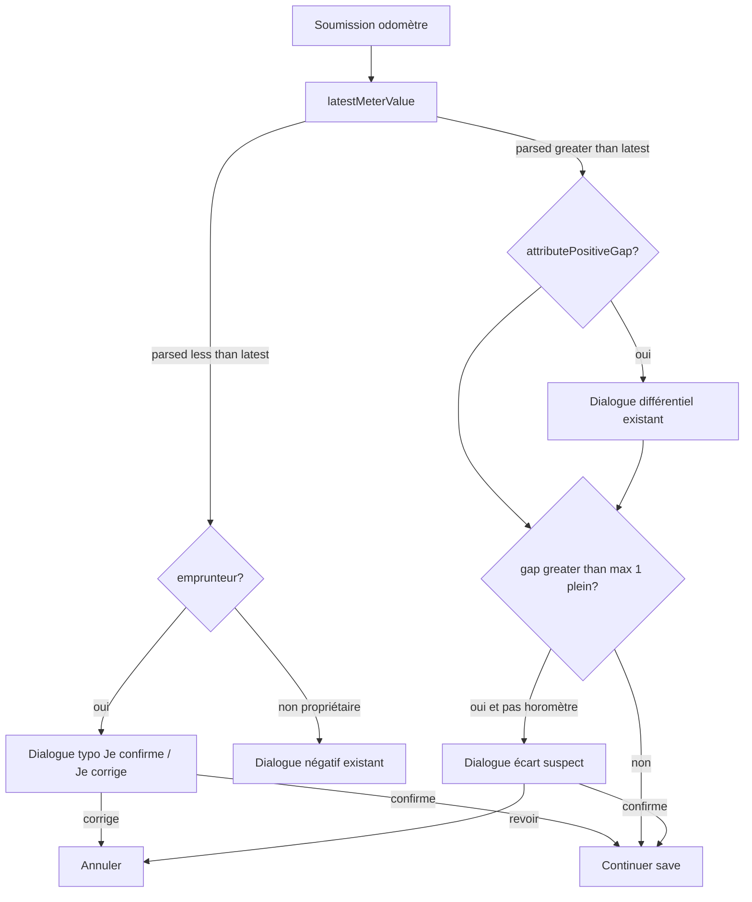

# Re-vérification odomètre emprunteur

## Contexte (déjà là)

- Dernier odomètre connu : `VehiclesRepository.latestMeterValue` / `latestMeterAnchor` ([vehicles_repository.dart](mobile/lib/db/repositories/vehicles_repository.dart)).
- Plafond « 1 plein » : [vehicle_odometer_gap_plausibility.dart](mobile/lib/vehicle/vehicle_odometer_gap_plausibility.dart) (`maxPlausiblePositiveGapTenths` / `isSuspiciousPositiveGap`).
- Flux UI central : [vehicle_gap_flow.dart](mobile/lib/vehicle/vehicle_gap_flow.dart) (`confirmMeterGapsBeforeSave`, `showSuspiciousPositiveGapDialog`).
- Capacité réservoir déjà syncée au partage (`fuelTankCapacityLiters` dans l’offre).

## Décision UX (confirmée)

- **Relevé trop bas (emprunteur)** : dialogue **simple typo** — corps du type « Vérifie ce chiffre » + actions **Je confirme** / **Je corrige** (pas le dialogue propriétaire « conserver / investiguer plus tard »).
- **Trop élevé** : réutiliser `showSuspiciousPositiveGapDialog` (existant).
- **Jamais de blocage dur** : annuler = retour à la saisie ; confirmer = continuer.

## Trous à fermer

Aujourd’hui dans `confirmMeterGapsBeforeSave` :

- Emprunteur + relevé **&lt; dernier connu** → **aucun** dialogue (passe silencieusement).
- Garde **trop élevé** (réservoir) → surtout **fin de session** (`confirmSuspiciousSessionEndDistanceBeforeSave`), pas carburant / entretien / début de session.

## Approche

Centraliser dans `confirmMeterGapsBeforeSave` (appelé déjà par les écrans concernés) :

1. **Négatif emprunteur** : remplacer le `return ok` silencieux par un nouveau `showBorrowerMeterRecheckDialog` (l10n EN/FR/ES). Si confirmé → `ok(divergenceTenths: …)` comme aujourd’hui ; sinon `cancel`.
2. **Trop élevé** : après la branche positive (ou même si `attributePositiveGap` est faux, dès qu’il y a un gap positif vs `latest`), si **pas** horomètre et `isSuspiciousPositiveGap` avec `maxPlausiblePositiveGapTenths(tank, guardL100)` → `showSuspiciousPositiveGapDialog`. Conso garde via `VehicleConsumptionMetrics` + `guardConsumptionLitersPer100Km` (même calcul que la fin de session).
3. **Fin de session** : garder `confirmSuspiciousSessionEndDistanceBeforeSave` (distance depuis dernier plein / début de session) — complementary ; éviter double dialogue suspect pour le même submit en n’appelant le check « vs latest + 1 plein » dans `confirmMeterGapsBeforeSave` seulement quand ce n’est **pas** déjà couvert, **ou** factoriser pour qu’un seul dialogue suspect s’affiche par save. Préférence concrète : dans `confirmMeterGapsBeforeSave`, appliquer le check « gap vs latest &gt; 1 plein » pour emprunteur (et propriétaire si déjà cohérent) ; à la fin de session, conserver le check session-spécifique (depuis dernier carburant) **sans** redemander si l’utilisateur vient déjà de confirmer un suspect sur le même `parsedMeter` — le plus simple et sûr : pour fin de session, laisser le check session existant ; pour les autres chemins (et début de session), le nouveau check dans `confirmMeterGapsBeforeSave`. Si les deux pourraient s’enchaîner (fin de session : `attributePositiveGap=false` donc pas de dialogue positif, puis check session), **aucun doublon** aujourd’hui — ne pas ajouter un second check « vs latest » sur le chemin fin de session où `confirmSuspiciousSessionEndDistanceBeforeSave` tourne déjà.

## Surfaces couvertes (déjà branchées sur `confirmMeterGapsBeforeSave`)

| Surface | Fichier |
|---|---|
| Session usage (début/fin) | [vehicle_use_session_screen.dart](mobile/lib/screens/vehicle/vehicle_use_session_screen.dart) |
| Carburant | [vehicle_quick_action_screens.dart](mobile/lib/screens/vehicle/vehicle_quick_action_screens.dart) |
| Entretien Huile | même fichier |

Pas de route emprunteur pour le relevé autonome (`/vehicle/.../meter-reading` = propriétaire seulement) — hors scope.

## L10n

Nouvelles clés (EN/FR/ES) pour le dialogue typo emprunteur, ex. :

- titre / corps : relevé plus bas que le dernier connu — vérifier le chiffre
- **Je confirme** / **Je corrige**

Réutiliser les chaînes `vehicleSuspiciousGap*` pour le trop élevé.

## Tests

- Unité / widget léger sur la branche emprunteur dans le flux de gap (négatif → cancel vs confirm ; positif suspect → dialogue).
- Étendre ou ajouter un test autour de `maxPlausiblePositiveGapTenths` / enchaînement si un helper pur est extrait.
- Analyser les fichiers touchés (`flutterw analyze`) ; tests ciblés (pas la suite complète sauf demande).

## Hors scope

- Nouveau sync « mémoire odomètre » dédié (on s’appuie sur `latestMeterValue` local).
- Blocage hard / refus définitif.
- Changer le dialogue négatif **propriétaire**.
- Scénario Maestro dédié.