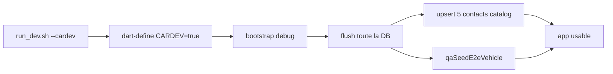

# Flag `--cardev` — seed contacts + véhicule

## Décisions figées

- **Contacts :** injection locale `kind == connected` avec les noms de [`SandboxBotCatalog`](mobile/lib/sandbox/sandbox_bot_catalog.dart) (Louys, Monica, Ròberr, Liuva, Leo) — **pas** d’entrée Simulation, pas de FakeRelay, pas de ribbon.
- **Véhicule :** réutiliser [`qaSeedE2eVehicle`](mobile/lib/debug/qa_vehicle_seed_helpers.dart) (« QA Civic », Honda Civic 2020, 50 000 km).
- **Reset :** chaque lancement avec `--cardev` **vide toute la DB opérationnelle**, puis reseede contacts + véhicule. Pas de tests parallèles entre modules sur la même base.
- **Plateforme :** le flag n’est **pas** limité à Android (Maestro / autres cibles possibles plus tard).

## Flux



## Changements

### 1. Script — [`mobile/tool/run_dev.sh`](mobile/tool/run_dev.sh)

- Parser `--cardev`.
- Si actif : ajouter `--dart-define=CARDEV=true` aux `run_args` (build normal).
- **Ne pas** refuser hors Android.
- Commentaire d’usage + ligne dans la description melos [`pubspec.yaml`](pubspec.yaml) `run:dev`.

### 2. Config — [`mobile/lib/config/app_config.dart`](mobile/lib/config/app_config.dart)

- Champ `carDevSeed` via `bool.fromEnvironment('CARDEV', defaultValue: false)`.

### 3. Seed — nouveau [`mobile/lib/debug/car_dev_seed.dart`](mobile/lib/debug/car_dev_seed.dart)

- `maybeApplyCarDevSeed(AppDatabase db, {required bool enabled})` :
  - no-op si `!enabled` / `!kDebugMode` ;
  - **flush DB complète** (réutiliser / étendre le clear existant type `clearDevOperationalTables` pour y inclure **toutes** les tables véhicule aussi — aujourd’hui ce helper ne les couvre pas) ;
  - upsert les 5 contacts (`contact:cardev:<Name>`, `connected`, avatars catalogue) ;
  - `qaSeedE2eVehicle(db)` ;
  - onboarding + profil minimal si besoin pour entrer dans l’app après wipe ;
  - `debugPrint('cardev seed: applied')`.

### 4. Bootstrap — [`mobile/lib/bootstrap.dart`](mobile/lib/bootstrap.dart)

- Quand `config.carDevSeed` : `await maybeApplyCarDevSeed(...)` au démarrage debug.
- Rien d’autre (pas de logique de coexistence avec d’autres seeds).

### 5. Vérif

- `cd mobile && ./tool/flutterw analyze --fatal-infos` sur les fichiers touchés.

## Usage attendu

```bash
./tool/melosw run run:dev -- --cardev
```

Relancer avec `--cardev` = DB vide + contacts Simulation + QA Civic. Sans le flag = comportement actuel.
