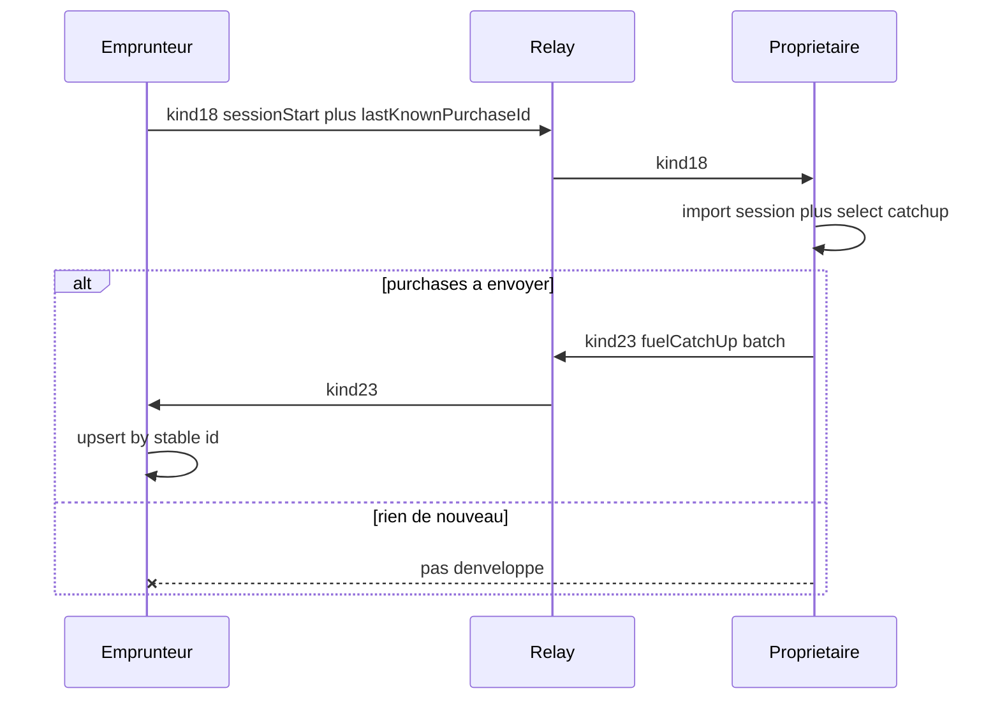

# Sync catch-up carburant au début de session

## Constat sur l’identifiant (réponse à ta question)

| Champ | Rôle aujourd’hui | Utile comme curseur cross-device ? |
| --- | --- | --- |
| `FuelPurchases.id` (`fuel:…`) | PK locale générée par `_newVehicleId` dans [`saveFuelPurchase`](mobile/lib/db/repositories/vehicles_repository.dart) | **Non tel quel** — chaque import recrée un **nouvel** id |
| `remotePurchaseId` (wire Emprunteur→Propriétaire) | Présent dans le JSON d’export, **ignoré à l’import** ([`importReceivedPurchase`](mobile/lib/vehicle/sharing/vehicle_fuel_purchase_transport_service.dart) rappelle `saveFuelPurchase` sans id) | **Oui si on le conserve** — c’est déjà l’id créateur côté Emprunteur |
| `purchasedAt` | Passé explicitement par l’app (`DateTime.now().toUtc()` à la saisie, ou recopié depuis le wire à l’import) — **pas** un `DEFAULT CURRENT_TIMESTAMP` SQL | Stable **si** propagé ; bon pour **ordonner**, pas assez pour l’unicité seule |
| `recordedByContactId` | `vehicle:owner:self` / `vehicle:borrower:self` vs id Contact du pair | **Pas le même string** d’un appareil à l’autre → inutilisable dans une empreinte « utilisateur » |

Conclusion : **on n’a pas aujourd’hui d’identifiant partagé fiable.** L’empreinte date/montant/km/utilisateur ne tient pas (surtout « utilisateur »). La correction structurelle : **propager et conserver l’id créateur** à chaque import (déjà sur le fil comme `remotePurchaseId` dans un sens). Le curseur de début de session = cet id. On garde `purchasedAt` dans les payloads pour l’ordre et l’affichage, pas comme clé primaire de matching.

## Règles produit (figées)

1. **Curseur présent** (Emprunteur a au moins un achat local) : le début de session envoie `lastKnownPurchaseId` (= id stable de son achat le plus récent par `purchasedAt`, puis meter). Le Propriétaire trouve cette ligne ; s’il la trouve, il envoie **tous les achats strictement après** (même critère d’ordre), **tous enregistreurs**. S’il ne la trouve pas (désync) : même comportement que (2).
2. **Pas de curseur** (aucun achat local côté Emprunteur) **ou** id introuvable chez le Propriétaire : envoyer le **dernier achat plein** (`isFullTank` + meter) **et tous les suivants** (propriétaire ou tout autre).
3. **Rien à envoyer** → **aucune** enveloppe (pas de batch vide).
4. Fin de session : pas de nouveau kind ; on compte sur le catch-up déjà reçu (async ; hors-ligne Propriétaire = cas dégradé accepté).

## Surfaces techniques

### A. Id stable (prérequis)

- Étendre `saveFuelPurchase` avec `String? id` optionnel (sinon `_newVehicleId` comme aujourd’hui).
- Emprunteur→Propriétaire : à l’import, **insérer avec `remotePurchaseId`** (idempotent si déjà présent : skip ou no-op).
- Catch-up Propriétaire→Emprunteur : chaque item porte le même `id` ; import Emprunteur upsert par id sur le véhicule partagé (**lever** le garde « must be owned locally » de l’import borrower→owner actuel — nouveau chemin dédié).
- Seeds QA qui dupliquent les mêmes faits sur deux AVD : **fixer les mêmes `fuel:…` ids** pour les achats partagés (sinon le curseur casse en Maestro).

### B. Étendre début de session (kind 18)

- Fichiers : [`vehicle_use_session_transport_service.dart`](mobile/lib/vehicle/sharing/vehicle_use_session_transport_service.dart), tests existants.
- Ajouter au `session_json` : `lastKnownPurchaseId` (`string?`). Résolu côté Emprunteur = id du dernier achat du véhicule (ordre `purchasedAt` desc).
- Pas de date dans le curseur.

### C. Nouveau kind 23 — catch-up

- [`envelopes.dart`](mobile/lib/relay/envelopes.dart) : `vehicleFuelPurchaseCatchUp = 23` + codec AEAD (même pattern que kind 20).
- **Pas de changement relay Go** (kinds 0–255 opaques ; déjà vérifié).
- Payload batch : `{ kind, linkId, vehicleId, purchases: [ { id, purchasedAt, costMinor, currency, isFullTank, volumeLiters, meterTenths, tankFillFraction, photo… } ] }` — réutiliser l’encodage photo de [`VehicleFuelPurchaseTransportService`](mobile/lib/vehicle/sharing/vehicle_fuel_purchase_transport_service.dart).
- Orchestrator : après import réussi du session start, calculer la liste ; si non vide → `sendVehicleFuelPurchaseCatchUp` vers l’Emprunteur (contact sender).
- Inbound Emprunteur : import upsert ; activity log sent/received.
- Helper repo : `listFuelPurchasesAfterCursor` / `listFuelPurchasesFromLastFullTankInclusive`.

### D. Seed WIP (ne plus masquer)

- Retirer l’injection artificielle des 20 L dans [`qa_vehicle_sharing_usage_history_wip_seed.dart`](mobile/lib/debug/qa_vehicle_sharing_usage_history_wip_seed.dart) (`seedQaVehicleSharingUsageHistoryWipBorrowerExtraEvents`).
- Aligner les ids fuel du journal 2nd-fill / WIP **identiques** Louys/Monica pour les faits déjà partagés.
- Couverture catch-up : **tests unitaires** transport + sélection ; le scénario Maestro WIP ne prouve le plafond 60+20 qu’après un vrai aller-retour relay (ou un harness de test qui appelle l’import catch-up) — à noter dans la doc QA, pas à fake via seed.

### E. OpenSpec

- Mettre à jour / ajouter scénarios dans `vehicle-sharing-module` (usage logging / role separation) : sync catch-up au session start ; owner fuel n’est plus « forever local-only » pour les Emprunteurs actifs via ce kind.
- Tâche dans [`openspec/changes/vehicle-sharing-module/tasks.md`](openspec/changes/vehicle-sharing-module/tasks.md) (et pointer depuis vehicle-module si besoin).

## Fichiers principaux

- [`mobile/lib/relay/envelopes.dart`](mobile/lib/relay/envelopes.dart) — kind 23
- [`mobile/lib/relay/handshake_orchestrator.dart`](mobile/lib/relay/handshake_orchestrator.dart) — send/handle catch-up ; déclencher après session start
- [`mobile/lib/vehicle/sharing/vehicle_use_session_transport_service.dart`](mobile/lib/vehicle/sharing/vehicle_use_session_transport_service.dart)
- Nouveau ou étendu : transport catch-up (près de `vehicle_fuel_purchase_transport_service.dart`)
- [`mobile/lib/db/repositories/vehicles_repository.dart`](mobile/lib/db/repositories/vehicles_repository.dart)
- Tests : transport session start, fuel catch-up, repo after-cursor
- Seeds + assert QA si besoin

## Hors scope

- Push FCM dédié (le relais + inbox suffisent comme pour les autres kinds véhicule).
- Catch-up à la fin de session ou push proactif à chaque achat propriétaire (tu as choisi le déclencheur début de session).
- Changement binaire relay.
