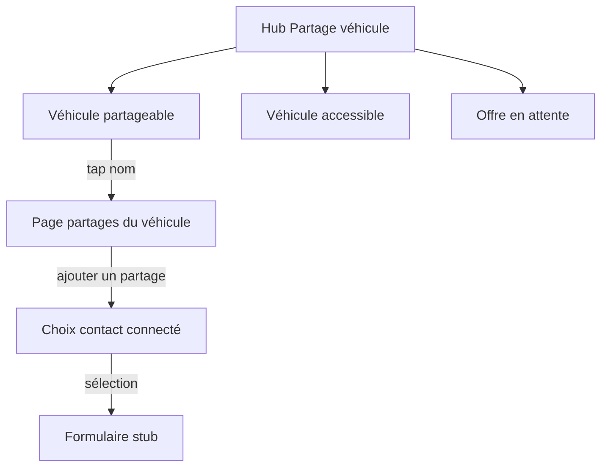

# Hub Partage de véhicule — 3 sections + détail partages

## Décisions figées (tes réponses)

- Crochet vert + liste détail = partages **actifs** seulement (`VehicleSharingLinkStatus.active`).
- Après choix du contact = **écran formulaire stub** (« contenu à définir ») — **pas** d’appel à `createSharingOffer` dans cette livraison.

## Comportement UI

### Hub ([`vehicle_sharing_hub_screen.dart`](mobile/lib/screens/vehicle_sharing/vehicle_sharing_hub_screen.dart))

Trois blocs **toujours** affichés, dans cet ordre :

| Section | Titre 0–1 item | Titre ≥2 items | Vide |
|---|---|---|---|
| 1 | Véhicule partageable | Véhicules partageables | Aucun |
| 2 | Véhicule accessible | Véhicules accessibles | Aucun |
| 3 | Offre en attente | Offres en attente | Aucune |

- **Partageable** : véhicules **actifs** du module Véhicule (`listActiveOwnedVehicles()` — même périmètre « à moi » que le module Véhicule, hors désactivés). Crochet vert (`Icons.check_circle`, couleur verte du thème) **devant** le libellé si au moins un lien **actif** pour ce véhicule. Tap → page détail.
- **Accessible** : conserver la logique Emprunteur actuelle (`listBorrowerAccessibleEntries`) + cartes odomètre/carburant si non vide.
- **Offre en attente** : conserver `listPendingBorrowerOffers` + bouton Accepter si non vide (déjà côté Emprunteur).

### Page détail partages (nouveau écran)

- Route : `/vehicle-sharing/:vehicleId/shares`
- Liste des contacts avec un lien **actif** sur ce véhicule (`listSharingLinksForVehicle` filtré `active` + libellés contacts).
- Action **ajouter un partage** → sélection d’un contact **connecté** (`kind == 'connected'`), en excluant ceux déjà liés **actifs** sur ce véhicule.
- Sélection contact → `/vehicle-sharing/:vehicleId/invite-form?contactId=…` : Scaffold titre du type « Nouveau partage » + corps texte du genre « Contenu du formulaire à définir » — **aucun** écriture DB.

Réutiliser / alléger [`vehicle_sharing_offer_screen.dart`](mobile/lib/screens/vehicle_sharing/vehicle_sharing_offer_screen.dart) pour le picker contact (aujourd’hui il envoie déjà l’offre : retirer cet envoi de ce parcours).

### Routes ([`app.dart`](mobile/lib/app.dart))

Sous `/vehicle-sharing`, ajouter avant les routes `:vehicleId/use|fuel` :

- `:vehicleId/shares`
- `:vehicleId/invite` (picker) et/ou `:vehicleId/invite-form` (stub)

Garder les routes use/fuel existantes.

### Localisation

Mettre à jour [`app_fr.arb`](mobile/lib/l10n/app_fr.arb) / [`app_en.arb`](mobile/lib/l10n/app_en.arb) / [`app_es.arb`](mobile/lib/l10n/app_es.arb) (+ regen) :

- Titres singulier / pluriel (clés séparées ou `plural` ICU).
- `Aucun` / `Aucune` (et équivalents EN/ES).
- Libellés page détail, ajouter partage, stub formulaire.
- Retirer ou ne plus utiliser `vehicleSharingAccessibleEmpty` long (« Aucun véhicule partagé… ») sur ce hub.

### Hors périmètre (cette livraison)

- Contenu métier du formulaire d’offre.
- Sync relay des liens.
- Crochet / détail pour liens *pending* côté Propriétaire.
- Stats / solde dû sur les cartes Emprunteur (spec plus large).

### Vérif

- `cd mobile && ./tool/flutterw analyze --fatal-infos .`
- `./tool/flutterw test` si la logique repo/UI touchée est couverte ou doute raisonnable ; sinon analyze seul si pure UI de strings/layout sans logique testée.