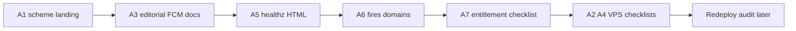

# Phase A — batch relay/entitlement (A1–A7, pas A8)

**Prompt session :** 8 (même chat ; alerte handoff à partir de 16).

**Décisions figées :** A6 **inclus** ; A8 **reporté** (pas d’URL store) ; A2/A4 = prep docs + checklists ops (exécution VPS = toi) ; pas de rename Docker/`github.com/compartarenta/…` (liste B).

**Ordre de travail (journée) :** A1 → A3 → A5 → A6 → A7 → fiches ops A2/A4 → tests → (redeploy/audit hors de ce plan jusqu’à ton go).

---

## A1 — Scheme `bojairu://` + landing (lockstep)

Aujourd’hui : **100 %** `compartarenta://` ; zéro `bojairu://`.

**App :**

- [`mobile/android/app/src/main/AndroidManifest.xml`](mobile/android/app/src/main/AndroidManifest.xml) — `android:scheme="bojairu"`
- [`mobile/ios/Runner/Info.plist`](mobile/ios/Runner/Info.plist) — `CFBundleURLSchemes` → `bojairu` (ajuster `CFBundleURLName` si besoin)
- [`mobile/lib/contacts/invitation_code.dart`](mobile/lib/contacts/invitation_code.dart) — emit + parse + extract/regex + `isContactInvitationAppLink`
- Commentaires : deep link listener, redeem screen
- Tests : [`invitation_code_test.dart`](mobile/test/invitation_code_test.dart), [`contacts_repository_test.dart`](mobile/test/contacts_repository_test.dart)

**Landing :**

- [`relay/deploy/landing/contact/invite/invite.js`](relay/deploy/landing/contact/invite/invite.js) + [`index.html`](relay/deploy/landing/contact/invite/index.html) — liens `bojairu://contact/invite…` ; copy **Compartarenta → Bojairũ** ; badges inchangés (sans href — A8 sauté)
- Commentaire scheme dans [`relay/deploy/apache2/relay-vhost.conf.template`](relay/deploy/apache2/relay-vhost.conf.template)

**Hors scope A1 :** path HTTPS `/contact/invite`, `applicationId`, modules Go.

---

## A3 — Éditorial (prose seulement)

Titres / runbooks → **Bojairũ** là où c’est le nom produit. **Ne pas** renommer `/srv/compartarenta-*`, users Docker, chemins compose, modules Go.

Cibles : [`relay/README.md`](relay/README.md), [`docs/relay-deployment.md`](docs/relay-deployment.md) (titres + prose ; garder ids techniques), [`entitlement/README.md`](entitlement/README.md), [`docs/stack-deployment.md`](docs/stack-deployment.md), en-têtes [`deploy/env.stack.example`](deploy/env.stack.example) / [`relay/.env.example`](relay/.env.example). Compléter la section FCM/WAKE manquante dans `relay-deployment.md` (lien déjà promis depuis `relay-state-schema.md`).

---

## A5 — `/healthz` lisible (petit Go)

Aujourd’hui : JSON `{ status, build, schema_version }` dans [`relay/internal/api/api.go`](relay/internal/api/api.go).

**Changement :** négociation `Accept` — `text/html` (ou navigateur) → page HTML minimale mobile-friendly (status, digest/build, schema) ; sinon JSON inchangé. Cocher la tâche dans [`openspec/changes/repo-maintenance-backlog/tasks.md`](openspec/changes/repo-maintenance-backlog/tasks.md). Tests Go du handler.

---

## A6 — `fires[]` + deux domaines (inclus)

Schéma SQL déjà OK (`0003`). Pattern existant : housing payment via reconcile **sans** `fires[]` client ([`scheduling.go`](relay/internal/api/scheduling.go)).

### A6.1 Relay

- Endpoints authentifiés upsert/cancel acceptant `fires[]` (`fire_at` wall-clock) pour domaines `contacts_invitation_expiry` et `housing_proposal_deadline` (peut être un handler générique par domaine + `scope_key`).
- Past fires : no-op / skip (client omet déjà les instants passés).
- Cancel par `scope_key` (+ kind/period si le modèle store l’exige).
- Tests Go ; doc HTTP dans `docs/relay-deployment.md` / state-schema si nouveaux paths.

### A6.2 Client — Contacts 3.7

Suivre [`scheduling-deadline-and-invitation-reminders/spec.md`](openspec/changes/housing-scheduled-payment-reminders/specs/scheduling-deadline-and-invitation-reminders/spec.md) + tasks 4.1–4.2 / contacts **3.7** :

- À la création d’invitation : upsert `before_expiry` + `expired` selon table 3h/8h/24h/48h.
- Cancel à used / revoked / extend (re-register).
- Prefs + ARB EN/FR/ES + deep link outstanding invitations.
- Brancher pending-deliveries → notif locale (réutiliser le chemin housing payment si présent).

### A6.3 Client — propositions 1.4b

- Domaine `housing_proposal_deadline` : register à dispatch (`expiresAt`) ; cancel à invalidate / expire / response.
- Lead times / rôles selon tasks OpenSpec 1.4b + même spec scheduling.
- ARB + gates notifs.

Marquer OpenSpec 4.1–4.4 / 3.7 / 1.4b au fur et à mesure.

---

## A7 — Checklist audit entitlement 5.4

Créer / étendre une checklist déploiement entitlement (nouveau fichier sous `docs/` ou section dédiée) alignée sur [`entitlement-server/tasks.md`](openspec/changes/entitlement-server/tasks.md) **5.4**, sans Phase B Play. Cocher 5.4.

---

## A2 / A4 — Ops (toi sur VPS ; agent prépare la checkliste)

**A2 :** service account FCM projet **`bojairu`** sur VPS ; `FCM_SERVICE_ACCOUNT_JSON_PATH` ; restart relay. Doc env complétée en A3. L’agent ne peut pas poser le JSON secret.

**A4 :** aligner [`docs/relay-audit-checklist.md`](docs/relay-audit-checklist.md) avec OpenSpec **11.2** / **11.6** (posture TTL/pays/stats ; cron sous user OS + première ligne `daily.jsonl`). Scripts cron déjà dans `relay/scripts/`.

---

## A8 — sauté

Pas de `href` Play/App Store tant que l’URL n’existe pas.

---

## Vérif avant redeploy (jour J — quand tu déclenches)

1. Diff app scheme + landing + Go healthz/`fires[]` + docs/checklists.
2. `go test` relay ; `flutter analyze` + tests deep link / scheduling clients.
3. Smoke local scheme (si appareil) ; landing syntax-check JS.
4. **Redeploy + audit** : fenêtre séparée après ton OK (liste checklist § jour J du doc source).

