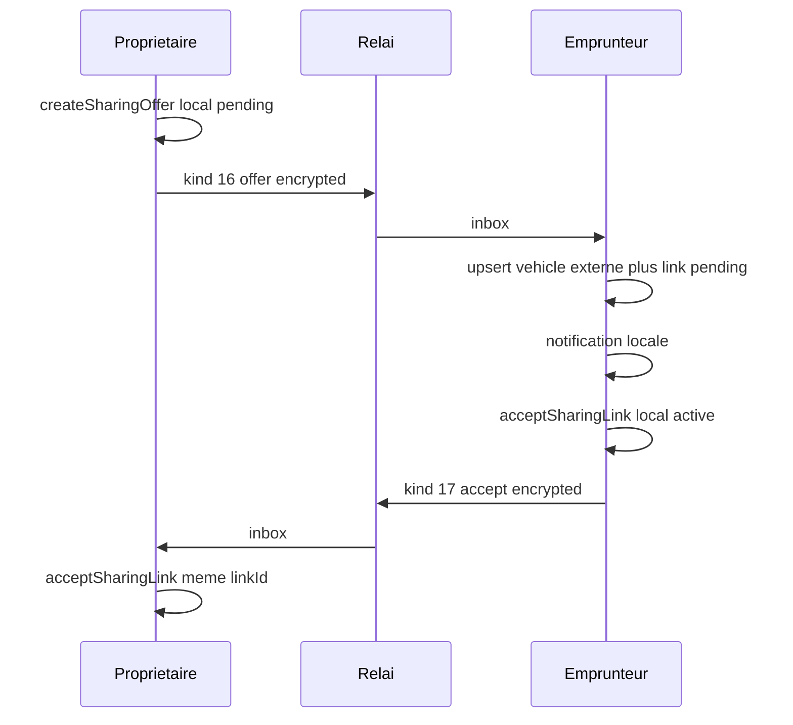

# Sync chiffré offre partage véhicule + notification + acceptation

## Décisions figées

- **Périmètre** : envoi offre + notification locale à la réception + sync acceptation (option 1).
- **Pas de changement relai Go** : kinds non gated ; `postEnvelope` opaque comme profil / hello.
- **Refus / decline** : hors livraison (bouton Accepter seulement, comme aujourd’hui).
- **Notification** : locale après import inbox (même chemin que le logement après wake FCM) ; tap → hub `/vehicle-sharing` ; gate = préférence maître notifications activées (pas de nouveau toggle réglages).

## Flux

## Couches à ajouter (miroir logement)

| Couche | Où |
|---|---|
| Kinds | [`EnvelopeKind`](mobile/lib/relay/envelopes.dart) **16** `vehicleSharingOffer`, **17** `vehicleSharingOfferAccept` |
| Crypto | `encrypt`/`decrypt` + HKDF info dédiés (`compartarenta/steady-v1/vehicle-sharing-offer-aead` / `-accept-aead`) |
| Transport | Nouveau service ex. [`mobile/lib/vehicle/sharing/vehicle_sharing_offer_transport_service.dart`](mobile/lib/vehicle/sharing/vehicle_sharing_offer_transport_service.dart) : export payload / import |
| Envoi / inbox | [`HandshakeOrchestrator`](mobile/lib/relay/handshake_orchestrator.dart) : `sendVehicleSharingOffer`, `sendVehicleSharingOfferAccept` ; branches dans `_pollSteadyStateInboxesBody` + `_handleInbound…` |
| Notif | [`PushNotificationService`](mobile/lib/notifications/push_notification_service.dart) : canal `vehicle_sharing_offers_v1`, `showLocalVehicleSharingOfferNotification`, payload tap `vehicle_sharing_offer` → `/vehicle-sharing` |
| UI | Formulaire invite appelle orchestrator après insert ; hub Accepter appelle sync après `acceptSharingLink` ; libellé pending = `displayLabel` véhicule |

## Payload offre (JSON dans AEAD)

- `kind`: `"vehicleSharingOffer"`
- `linkId`, `createdAt`
- `ratePerKmMinor`, `rateCurrency`, `availabilityWeekJson`, `ownerRulesText`
- `vehicle`: snapshot minimal pour affichage Emprunteur — `id`, `vehicleKind`, `displayLabel`, `make`, `model`, `color`, `modelYear`, `licensePlate`, `fuelTankCapacityLiters`, `consumptionEstimationMode`, `requireDetailedDrivingMixForBorrowers`

**Import Emprunteur** ([`VehiclesRepository`](mobile/lib/db/repositories/vehicles_repository.dart)) :

- Upsert `Vehicles` avec **même** `vehicle.id`, `ownerContactId` = contact expéditeur local.
- Upsert `VehicleSharingLinks` : même `linkId`, `ownerContactId` = expéditeur, `borrowerContactId` = nouvelle constante `kVehicleBorrowerSelfContactId` (`vehicle:borrower:self`) pour le chemin Emprunteur local (usage / cartes).
- Idempotent si déjà reçu.

**Accept** payload : `{ "kind": "vehicleSharingOfferAccept", "linkId", "acceptedAt" }` → propriétaire : `acceptSharingLink(linkId)` si pending.

## Branche UI / repo

1. [`vehicle_sharing_invite_form_screen.dart`](mobile/lib/screens/vehicle_sharing/vehicle_sharing_invite_form_screen.dart) : après `createSharingOffer`, `HandshakeOrchestrator.instance.sendVehicleSharingOffer(linkId: …)` ; échec réseau → snackbar, offre locale conservée (réessai manuel hors scope sauf message clair).
2. Hub Accepter : `acceptSharingLink` puis `sendVehicleSharingOfferAccept`.
3. Améliorer titre pending : label véhicule au lieu de `link.vehicleId` brut.
4. Écouter `steadyStateInboxTick` sur le hub pour recharger après import (comme écrans logement).

## Relai / entitlement

- **Aucun** edit sous `relay/` : kinds 16/17 hors `IsGatedKind`.
- Gates entitlement app existants (`canOfferSharing` / PE) restent côté client.

## Tests / vérif

- Tests unitaires codec encrypt→decrypt + import upsert (lien + véhicule externe).
- `cd mobile && ./tool/flutterw analyze --fatal-infos .` puis `./tool/flutterw test` (changement sync).

## Hors périmètre

- Decline, revoke sync, usage facts → propriétaire, gating entitlement serveur, nouveau toggle notif réglages, photos véhicule dans l’offre.
